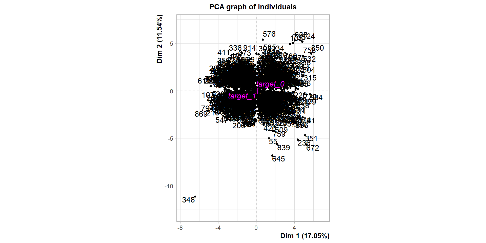
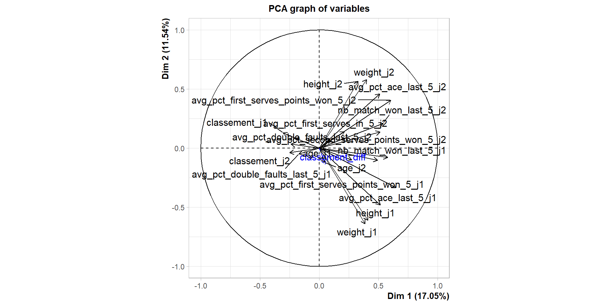

# Problématique

1.  Construire un modèle permettant de prédire le résultat d'un match de tennis en simple, à partir d'informations sur les joueurs qui s'affrontent et sur le tournoi.

2.  Classification supervisée : prédire Y (0 ou 1), à partir de variables explicatives quantitatives et qualitatives.

# Constitution de la base des matches

## Importation des fichiers

Les fichiers source ont été récupérés sur le site [datahub](https://datahub.io/sports-data/atp-world-tour-tennis-data) :

-   Matchs stats
-   Matchs scores
-   Joueurs (n = 10 912)
-   Classements (n = 2 694 539)
-   Tournoi (n = 4 114)

# Exploration de la base


::: {.cell}

:::


## Univarié


::: {.cell}

:::

::: {.cell}

```{.r .cell-code}
summary(data)
```

::: {.cell-output .cell-output-stdout}
```
 target      weight_j1        height_j1         age_j1      classement_j1    
 0:74962   Min.   :  0.00   Min.   :  0.0   Min.   :16.00   Min.   :   1.00  
 1:74962   1st Qu.: 75.00   1st Qu.:180.0   1st Qu.:23.00   1st Qu.:  27.00  
           Median : 79.00   Median :185.0   Median :26.00   Median :  60.00  
           Mean   : 79.73   Mean   :185.3   Mean   :26.08   Mean   :  84.12  
           3rd Qu.: 84.00   3rd Qu.:191.0   3rd Qu.:29.00   3rd Qu.: 105.00  
           Max.   :108.00   Max.   :211.0   Max.   :44.00   Max.   :1922.00  
 nb_match_won_last_5_j1 avg_pct_ace_last_5_j1 avg_pct_double_faults_last_5_j1
 Min.   :0.000          Min.   : 0.000        Min.   : 0.000                 
 1st Qu.:2.000          1st Qu.: 4.034        1st Qu.: 2.604                 
 Median :3.000          Median : 6.289        Median : 3.661                 
 Mean   :2.635          Mean   : 7.151        Mean   : 3.914                 
 3rd Qu.:3.000          3rd Qu.: 9.328        3rd Qu.: 4.949                 
 Max.   :5.000          Max.   :37.024        Max.   :22.605                 
 avg_pct_first_serves_in_5_j1 avg_pct_first_serves_points_won_5_j1
 Min.   : 9.455               Min.   :21.82                       
 1st Qu.:54.909               1st Qu.:39.17                       
 Median :59.188               Median :42.45                       
 Mean   :58.778               Mean   :42.64                       
 3rd Qu.:63.308               3rd Qu.:45.91                       
 Max.   :84.997               Max.   :65.99                       
 avg_pct_second_serves_points_won_5_j1   weight_j2        height_j2    
 Min.   :25.85                         Min.   :  0.00   Min.   :  0.0  
 1st Qu.:47.06                         1st Qu.: 75.00   1st Qu.:180.0  
 Median :50.91                         Median : 79.00   Median :185.0  
 Mean   :50.94                         Mean   : 79.73   Mean   :185.3  
 3rd Qu.:54.80                         3rd Qu.: 84.00   3rd Qu.:191.0  
 Max.   :82.76                         Max.   :108.00   Max.   :211.0  
     age_j2      classement_j2     nb_match_won_last_5_j2 avg_pct_ace_last_5_j2
 Min.   :16.00   Min.   :   1.00   Min.   :0.000          Min.   : 0.000       
 1st Qu.:23.00   1st Qu.:  27.00   1st Qu.:2.000          1st Qu.: 4.034       
 Median :26.00   Median :  60.00   Median :3.000          Median : 6.289       
 Mean   :26.08   Mean   :  84.12   Mean   :2.635          Mean   : 7.151       
 3rd Qu.:29.00   3rd Qu.: 105.00   3rd Qu.:3.000          3rd Qu.: 9.328       
 Max.   :44.00   Max.   :1922.00   Max.   :5.000          Max.   :37.024       
 avg_pct_double_faults_last_5_j2 avg_pct_first_serves_in_5_j2
 Min.   : 0.000                  Min.   : 9.455              
 1st Qu.: 2.604                  1st Qu.:54.909              
 Median : 3.661                  Median :59.188              
 Mean   : 3.914                  Mean   :58.778              
 3rd Qu.: 4.949                  3rd Qu.:63.308              
 Max.   :22.605                  Max.   :84.997              
 avg_pct_first_serves_points_won_5_j2 avg_pct_second_serves_points_won_5_j2
 Min.   :21.82                        Min.   :25.85                        
 1st Qu.:39.17                        1st Qu.:47.06                        
 Median :42.45                        Median :50.91                        
 Mean   :42.64                        Mean   :50.94                        
 3rd Qu.:45.91                        3rd Qu.:54.80                        
 Max.   :65.99                        Max.   :82.76                        
 tourney_surface tourney_conditions classement_diff
 Carpet:    0    Indoor : 21636     Min.   :-1753  
 Clay  :50786    Outdoor:128288     1st Qu.:  -42  
 Grass :16614                       Median :    0  
 Hard  :82524                       Mean   :    0  
                                    3rd Qu.:   42  
                                    Max.   : 1753  
```
:::
:::


## ACP


::: {.cell}
::: {.cell-output-display}
{width=960}
:::

::: {.cell-output-display}
{width=960}
:::
:::


## Valeurs propres


::: {.cell}
::: {.cell-output-display}
{width=960}
:::
:::


## Arbre


::: {.cell}
::: {.cell-output .cell-output-stdout}
```
[1] 2
```
:::
:::


# Comparaison des modèles

# Généralisation du modèle

